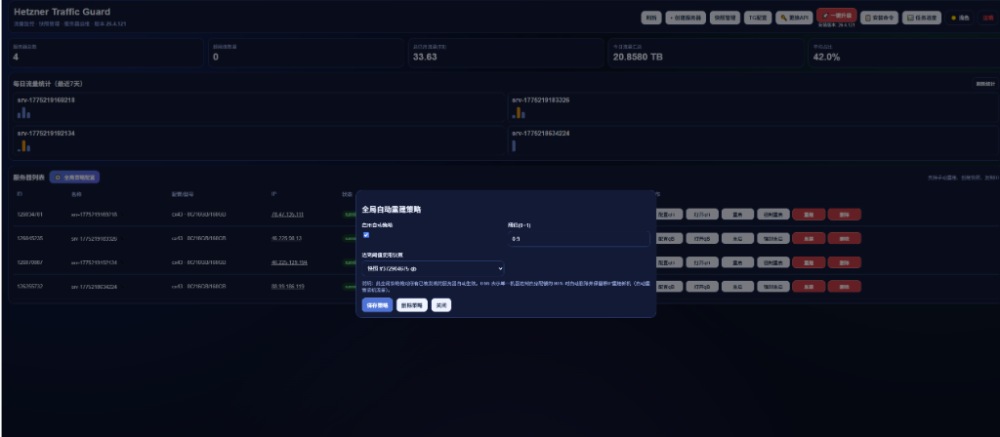

# 🛡️ Hetzner Traffic Guard (HZC)

专为 Hetzner 服务器打造的智能化流量管理与自动化运维全栈面板。从日常流量监控到极端情况下的自动重装防御，HZC 致力于以最简单的配置，提供最具安全感的服务器托管体验。

> 💡 **核心目标**：自动、无感、安全。部署完成即可释放双手，避免过高的流量溢出账单。



---

## ✨ 核心特性

- **📊 流量深度监控**：直观展示每月出站流量、今日流量、剩余额度。支持 qBittorrent 客户端级别的数据同步。
- **🔄 全局中心化策略**：通过列表顶部的“全局策略”入口统一配置。支持多机并发重建，自动继承 qBittorrent 节点信息。
- **📸 计划任务与快照**：支持服务器 **定时计划删除**（内置账期周年日/月底自动对位预填），提供详细的快照成本预估与管理。
- **🛡️ 强大的防呆保护**：针对未设策略的机器，实时监控流量。达到限额前 1TB 持续预警，触碰限额立即自动关机，根除超额账单。

---

## 🚀 极速部署 (推荐)

### 选项 A：从 Docker 镜像安装

最省心、且完全避免环境污染的部署方式：

```bash
docker run -d \
  --name hetzner-traffic-guard \
  -p 1227:1227 \
  -v /var/run/docker.sock:/var/run/docker.sock \
  -v $(pwd)/state:/app/state \
  -e HETZNER_TOKEN="YOUR_HETZNER_API_TOKEN" \
  ghcr.io/fc0012/hzc:latest
```
*(注意：首次启动需要通过界面右上角/提示页设置面板访问账号)*

### 选项 B：使用 Docker Compose

在服务器上创建 `docker-compose.yml`：

```yaml
services:
  hetzner-traffic-guard:
    image: ghcr.io/fc0012/hzc:latest
    container_name: hetzner-traffic-guard
    restart: unless-stopped
    ports:
      - "1227:1227"
    environment:
      - HETZNER_TOKEN=your_token_here
    volumes:
      - ./state:/app/state
      - /var/run/docker.sock:/var/run/docker.sock
```

随后运行：
```bash
docker-compose up -d
```

### 选项 C：极简一件安装脚本 (一键解决所有环境依赖)

```bash
bash <(curl -fsSL https://raw.githubusercontent.com/fc0012/hzc/main/scripts/bootstrap.sh)
```

---

## ⚙️ 进阶配置与环境变量

HZC 支持以环境变量形式覆盖绝大部分参数。配置一次，持续生效。

| 环境变量 | 默认值 | 说明 |
| :--- | :--- | :--- |
| `HETZNER_TOKEN` | *必须* | 您的 Hetzner Cloud API Key |
| `TRAFFIC_LIMIT_TB` | `20` | 单台机器的默认出网流量上限 (TB) |
| `ROTATE_THRESHOLD` | `0.9` | 触发自动重建逻辑的百分比阈值（0.9 即 90%） |
| `TELEGRAM_BOT_TOKEN` | *空* | 用于接收警告通知 / TG 运维机器人的 Token |
| `TELEGRAM_CHAT_ID` | *空* | 用于接收报警通知人的个人数字 ID |
| `CHECK_INTERVAL_MINUTES`| `5` | 轮询与自动防卫检查的周期时间 (分钟) |

---

## 🤖 自动化工作流与数据迁移机制

新版本的 HZC 实现了完整的自动化周期管理：
1. **统一的全局策略**：自动化策略采用单点全局化管理，再也不用为每台新旧服务器逐一绑定。配置下发瞬间全军列装。
2. **连接不中断**：自动继承原服务器关联的 qBittorrent 节点信息。不需要人工干预二次绑定。
3. **状态复位**：自动化重置流量监控计费基数，全新计算当月使用量。

---

## 🛠️ 运维与升级指示

如果您想要让正在运行的面版更新到最新版代码：

**Web端：**
访问面板页面，点击顶部导航栏中的 `🚀 一键升级`。

**Telegram 端：**
在绑定后的聊天框内直接发送：`/upgrade`。

**手动 Shell 升级（排障兜底）：**
```bash
cd hzc
./scripts/upgrade.sh
```
>*升级机制会自动对比 GitHub Main 分支代码差异以判断并下发容器更新指令，不丢失基于数据卷挂载的历史日志。*